<!--

À l'attention du lecteur :

Ce document est un fichier markdown.
La lecture est plus agréable dans un logiciel sachant l'afficher (ex: navigateur web)

-->

# Dossier de conception

Logiciel : Projet S5

Equipe de développement :

 - Vincent FOUGERAS
 - Quentin MARTY
 - Pierre POMERET-COQUOT

(L3 Info groupe 1)

## 1. Cahier des charges

Production de trois logiciels :

 - Application client
 - Application administrateur
 - Serveur

### 1.a. Application client

Interface graphique client.

Fonctionnalités :

 - Connexion avec couple identifiant/mot de passe
 - Consultation de la liste des groupes
 - Création d'un ticket à destination d'un groupe
 - Ajout d'un message sur un ticket (crée par l'utilisateur ou a destination de l'un de ses groupes).
 - Consultation des tickets et messages

Propriétés des messages : 

 - Date d'émission
 - Statut de lecture (non transmis, reçu, lu)

### 1.b. Application administrateur

Fonctionnalités :

 - Création/suppression de groupes
 - Création/suppression de comptes utilisateur
 - Création/suppression de liens d'appartenance utilisateur-groupe
 - Suppression de tickets / messages

### 1.c. Serveur

Serveur gérant les applications client et administrateur.

Fonctionnalités :

 - Permettre la connexion simultanée de multiples applications client
 - Répondre aux requètes des applications client
 - Vérifier la validité des requetes provenant des applications client
 - Enregistrer l'information nécessaire aux applications client.
 - Permettre la connexion d'une application administrateur
 - Exécuter et répondre aux requêtes de l'application administrateur

Le serveur utilisera une base de données

## 2. Analyse

### 2.1. Modèle de données

L'information peut être modélisée ainsi :

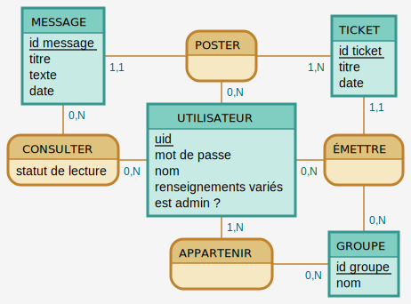

## 3. Axes de développement

L'application sera écrite en Java. La base de donnée utilisera le SGDB mySQL.

### 3.1. Modèle de données	

#### 3.1.a. SQL

> **MESSAGE** ( <u>*id message*</u>, titre, texte, date, #uid émetteur, #id ticket )  
> **TICKET** ( <u>*id ticket*</u>, titre, date, #uid créateur, #id groupe )  
> **CONSULTER** ( <u>*#id message, #uid lecteur*</u>, statut de lecture )  
> **UTILISATEUR** ( <u>*uid*</u>, mot de passe, nom, renseignements variés, est admin ? )  
> **APPARTENIR** ( <u>*#uid, #id groupe*</u> )  
> **GROUPE** ( <u>*id groupe*</u>, nom )

#### 3.1.b. Java

Au sein d'un package *modele* destiné aux applications et au serveur.

L'information sera contenue dans les classes suivantes : 

 - Groupe (contient des tickets)
 - Ticket (contient des messages)
 - Message (contient un utilisateur)
 - Utilisateur

Chacune de ces classes peut être identifiée par un entier ou une chaîne de caractère unique.
Par ailleurs, la classe Ticket pourra être instanciée avec des lacunes (sans savoir les messages contenus dans ce ticket) : ces lacunes seront comblées à la demande par l'application.

Diagramme de classe : 
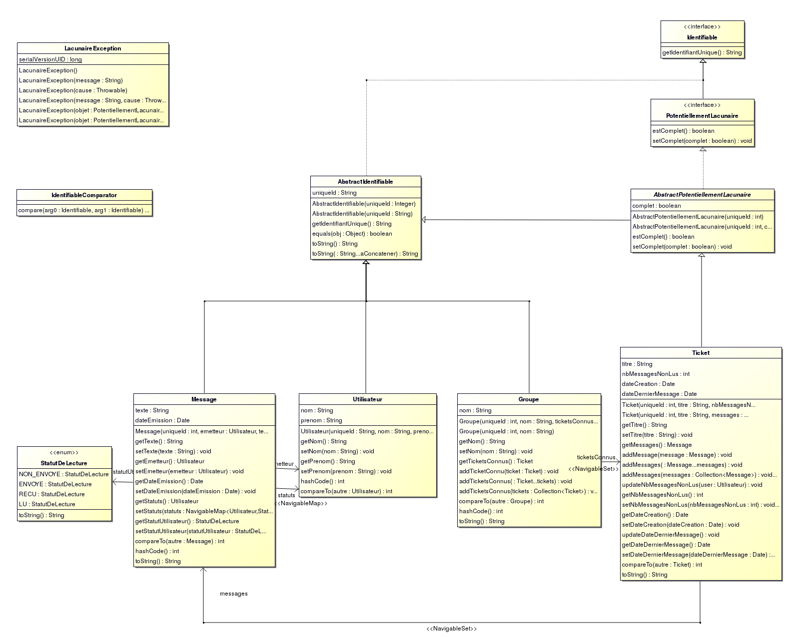

### 3.2. Communication réseau

Idée générale :

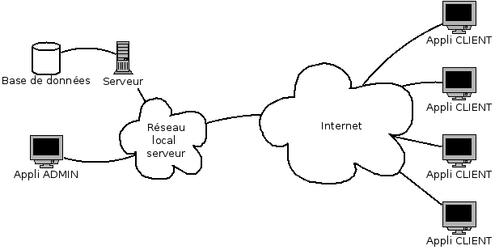

Communication sur TCP : 

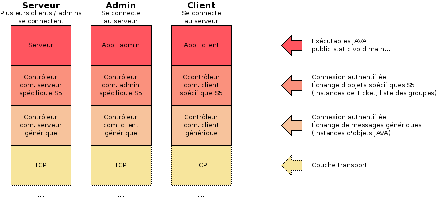

La communication réseau est assurée par trois packages :

#### 3.2.a. Package *communication*

Interfaces pour un outil générique permettant la connexion authentifiée de clients à un serveur, et leur dialogue. 

 - **ControleurComClient** : dialogue avec un ControleurComServeur
 - **ControleurComServeur** : dialogue avec plusieurs ControleurComClient
 - **ObservateurComClient** : est informé des messages reçus par un ControleurComClient
 - **ObservateurComServeur** : est informé des messages reçus par un ControleurComServeur

Prévu pour être réutilisé dans d'autres logiciels : ne dépend pas du modèle de données choisi.

#### 3.2.b. Package *communication.simple*

Implémentations concrètes des interfaces définies dans le package *communication*.

#### 3.2.c. Package *commChatS5*

Implémentation de contrôleurs spécifiques aux applications développées :
 - CtrlComClient
   - Demander la liste des groupes et leurs contenus (tickets)
   - Demander le contenu d'un ticket
   - Créer un nouveau ticket / message
   - Etre informé d'un nouveau ticket / message
 - CtrlComAdmin
   - Consulter toutes les données
   - Modifier toutes les données
   - Supprimer toutes les données
 - CtrlComServeur
   - Traite les requêtes des clients et admin

Les interfaces suivantes permettent aux applications client, admin et serveur d'être informées par un contrôleur :

 - S5Client : méthodes qu'utilise un CtrlComClient pour informer l'appli client
 - S5Admin : méthodes qu'utilise un CtrlComAdmin pour informer l'appli admin
 - S5Serveur : méthodes qu'utilise un CtrlComServeur pour produire les réponses aux requêtes des clients / admin

### 3.3. IHM et Controleur de l'application client

Diagramme de classe :
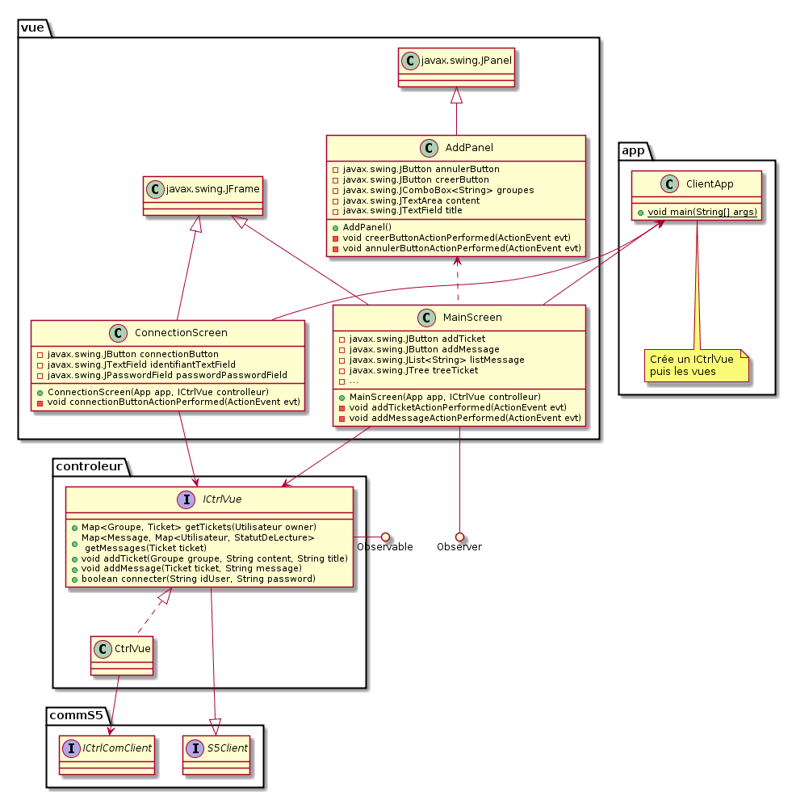

Maquettes de l'IHM :
Ecran de connexion :  
  
Ouverture de l'application :  
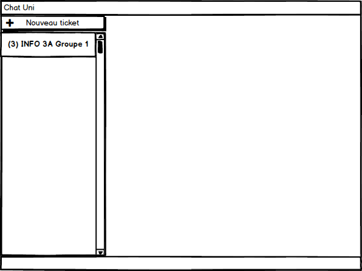  
Création d'un nouveau ticket :  
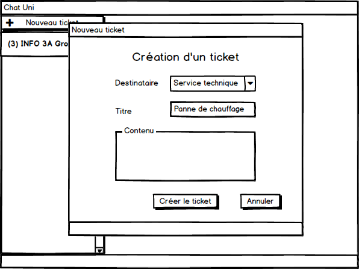  
Après la création du ticket :  
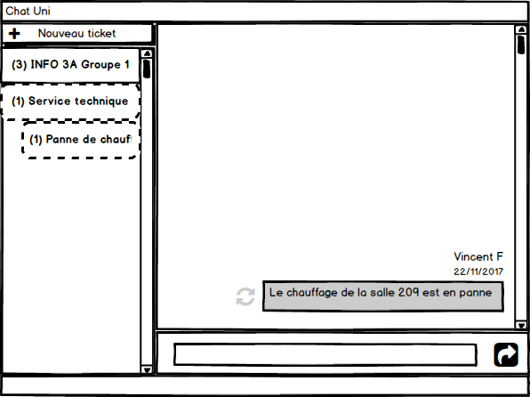  
Déroulement du groupe "INFO 3A Groupe 1" :  
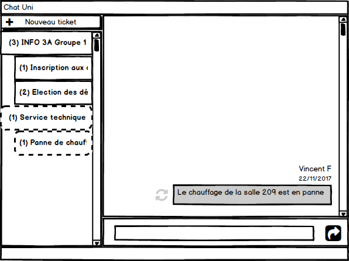  
Ouverture d'un ticket contenant plusieurs messages :  
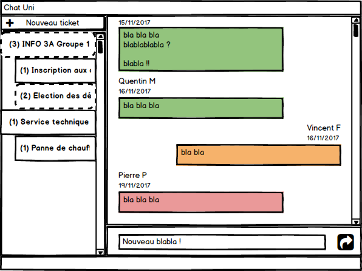  
Ajout d'un message sur ce ticket :  
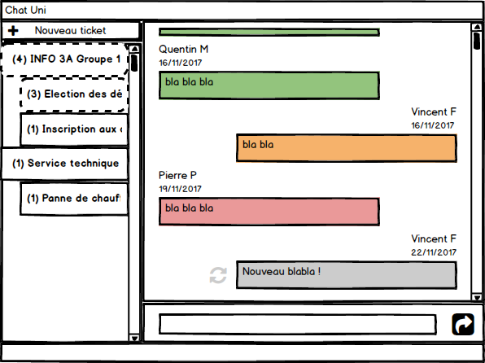  
Détails d'un message :  
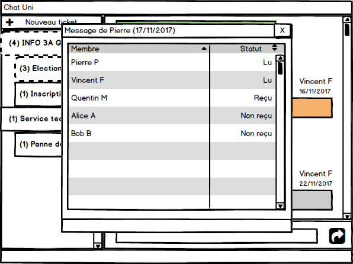  

### 3.4. IHM et Controleur de l'interface administrateur

Diagramme de classe :
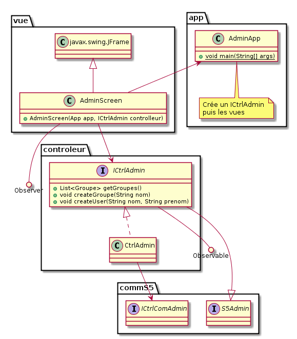

Maquettes de l'IHM :
Onglet des groupes :  
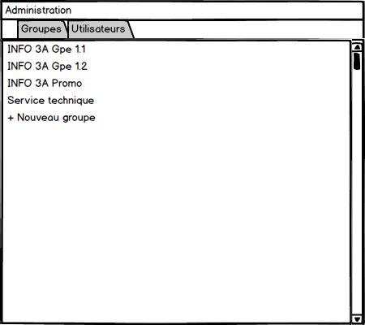  
Onglet des utilisateurs :  
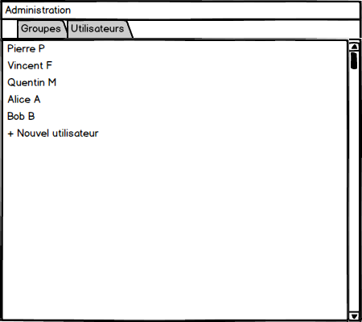  
Détails d'un groupe :  
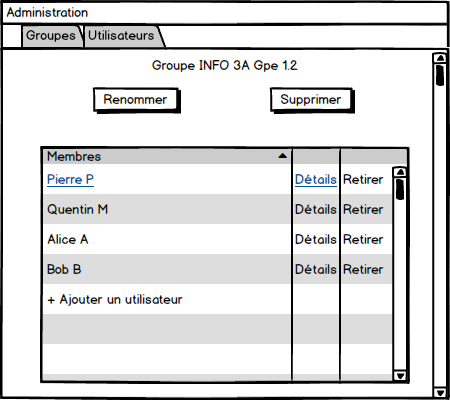  
Détails d'un utilisateur :  
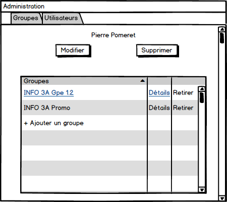  

## 4. Calendrier

**Semaine 47**

 - Définition modèle de données
 - Définition com réseau
 - Définition base de donnée
 - Définition application client

**Semaine 48**

 - Implémentation com réseau générique
 - Implémentation base de données
 - Application client : vues

**Semaine 49**

 - Dossier de conception complet
 - Implémentation com réseau spécifique simple
 - Application client : contrôleur

**Semaine 50**

 - Fermeture du dépôt : dossier de conception (lundi 11/12)
 - Com réseau : reprise sur incident
 - Serveur : v0

**Semaine 51**

 - Examens

**Semaine 52**

 - Vacances

**Semaine 1**

 - Vacances
 - Serveur
 - Application admin

**Semaine 2**

 - Finitions
 - Relectures et fioritures

**Semaine 3**

 - Fermeture du dépot : code source (lundi 15/01)
 - Soutenance (mercredi 17/01)

### Planning

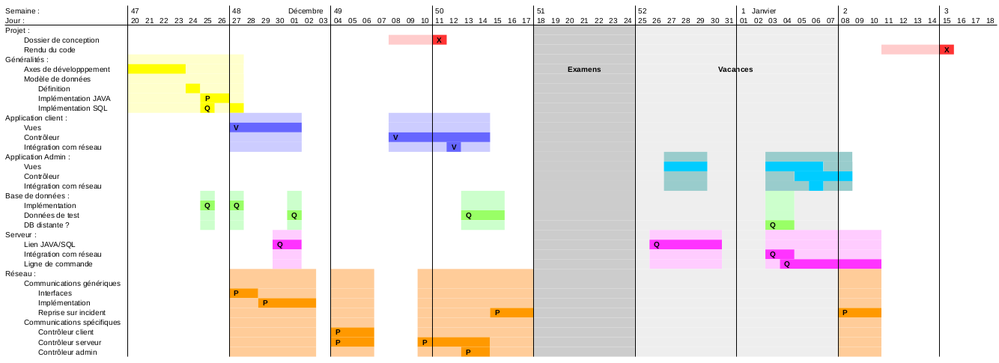

